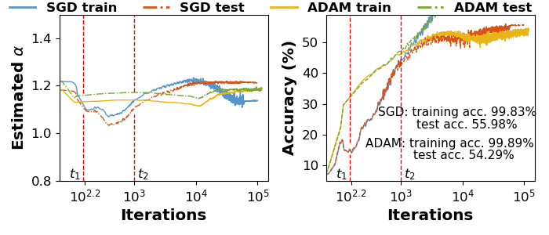

## Towards Theoretically Understanding Why SGD Generalizes Better Than ADAM in Deep Learning

This is a PyTorch implementation of [Why SGD generalizes better than Adam](https://arxiv.org/pdf/2010.05627.pdf):
```
@inproceedings{zhou2020generalizationdeep,
  title={Towards Theoretically Understanding Why SGD Generalizes Better Than ADAM in Deep Learning},
  author={Pan Zhou and Jiashi Feng and Chao Ma and Caiming Xiong and Steven Hoi and Weinan E},
  booktitle={Neural Information Processing Systems},
  year={2020}
}
```
### Prepare
Our environment is Pytorch 1.2 and torchvision 0.4. 

### Generalization Experiments
Please find the test code in the "main.py" file. You can directly run it by selecting SGD or ADAM optimizer. This code mainly depends on the [implementation](https://github.com/umutsimsekli/sgd_tail_index) of the paper "A Tail-Index Analysis of Stochastic Gradient Noise in Deep Neural Networks" which analyzes the convergence behaviors of SGD on one-dimentional problem. The main differnece is that we theoretically compare the generalization performance between SGD and ADAM on the high-dimensional deep learning problems.

To obtain the convergence trajectory data of SGD and ADAM, you can directly run "main.py".

To show the convergence trajectory of SGD and ADAM in terms of noise and the training/test accuracy, you can directly run "plot_CIFAR10.py". 

<p align="center">
  
</p>

### License

This project is under the MIT License. See [LICENSE](LICENSE) for details.
